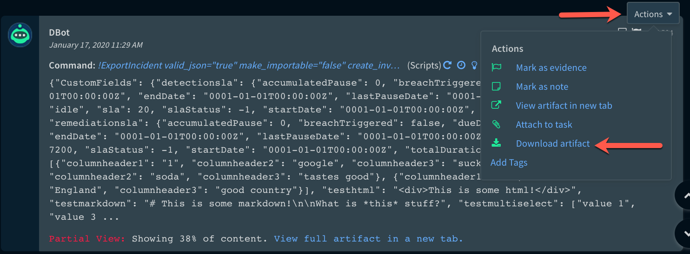

# XSOAR Incident Creator

This web application will create incidents in Cortex XSOAR over the XSOAR REST API, using custom incident field definitions.  These incidents are incidents which have either been exported from XSOAR, or mapped from a 3rd-party JSON file.  It allows for:

- Selection of which incident fields to create.
- The ability to edit field values, including JSON.
- It will also prohibit the creation of fields which are not defined in XSOAR,
- Bulk incident creation...
- To one or more XSOAR servers

### Why would I use this?

- I'm writing/testing an XSOAR playbook and I need to create incidents for testing
- I'm an XSOAR SE or SA and I need to easily create demo incidents without the headache of configuring integrations, 3rd-party products, and ingesting the incidents.  As anyone who has tried sending emails for creating demo incidents well knows, this can consume hours of time in mucking about with email security, spam and malware filters, and other bother.
- I'm running a XSOAR workshop or training exercise and need the ability to push incidents to multiple XSOAR servers quickly.

## Exporting an Incident from XSOAR

Run this command from within an incident war room in XSOAR.  Note that it is not yet part of XSOAR content -- you can find it in the `automations/` subdirectory in this repository):

`!ExportIncident make_importable=false create_investigation=false`

This will create a JSON dump of the current incident's fields.  Save the output to a file with a .txt or .json extension.

## Editing JSON

This app provides a text-style JSON editor for JSON-type incident fields.  The JSON must be well-formatted in order to be accepted.

## Running for the First Time

The client is not distributed in pre-built form, so to run it for the first time, one must either start the Angular client in development mode or build the client using the below instructions.  If running in development mode, this means that one will have two servers running - both the Node.js server and the Angular compiler / server.

1.  Install Node.js.  This is beyond the scope of this Readme.
2.  Clone this repository by running `git clone https://github.com/tundisto/xsoar-incident-creator.git`.
2.  Install all necessary packages by running `npm install && cd server && npm install && cd ..` from the cloned repo's directory.
3.  Start the Node.js server by running `npm run server`.
4.  In a separate terminal, start the Angular compiler using `npm start`.

### XSOAR API Key

Before this app can be used, An API key must first be generated within Cortex XSOAR. using `Settings -> Integrations -> API Keys -> Get Your Key`.  Enter this key and the server infornation into the XSOAR Servers section of the app.

## Running the Node.js server

Run `npm run server` to start the Node.js server.  If the `dist/` subdirectory is found, the pre-compiled Angular application will be served statically from it.  If `dist/` isn't found, it will run in development mode by proxying the Angular development server.

## Running the Node.js server in development mode

Use `npm run server-dev` to run the server in development mode, which will only proxy the Angular development server, rather than serving `dist/` statically.

## Running the Angular client in development mode

Run `npm start` to start the Angular client app in development mode, allowing live-reload if making changes to the client source (in the `src/` subdirectory).

## Building the Angular client

Run `npm run ng -- build` to build the project in development mode (yes, there is a space between '--' and 'build').  The build artifacts will be stored in the `dist/` subdirectory. Add the `--prod` flag for a production build.

## Running in Docker

This project is distributed as a Docker image.

## Note on Storing Configuration Data of Docker Containers

It's recommended that when creating or running a container, the configuration data be stored on your host filesystem rather than on the container's filesystem.  Without doing this, your configuration will be lost any time the container is removed or upgraded.  This is accomplished by creating a directory in your host profile to store the config, and then mapping it into the container with the docker command line option `-v`.  For example: 

1. Create a directory called `xicconf` under your home directory: `mkdir ~/xicconf`

2. The docker command line parameter to map that directory would be: `-v ~/xicconf:/opt/xsoar/xsoar-incident-creator/server/etc`
 
This will be reflected in the below command line examples.

### Running a temporary container:

`docker run -p 4002:4002 -ti --rm -v ~/xicconf:/opt/xsoar/xsoar-incident-creator/server/etc tundisto/xsoar-incident-creator:latest`

### Creating a container

`docker create -p 4002:4002 --name xsoar-incident-creator -v ~/xicconf:/opt/xsoar/xsoar-incident-creator/server/etc tundisto/xsoar-incident-creator:latest`

### Starting the conatiner:

`docker start xsoar-incident-creator`

### Stopping the container:

`docker stop xsoar-incident-creator`

## Connecting to the Application

Browse to https://yourserver:4002 in your favourite web browser to launch the application.
